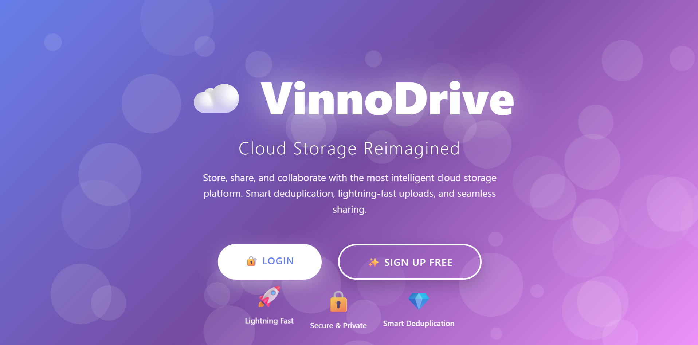
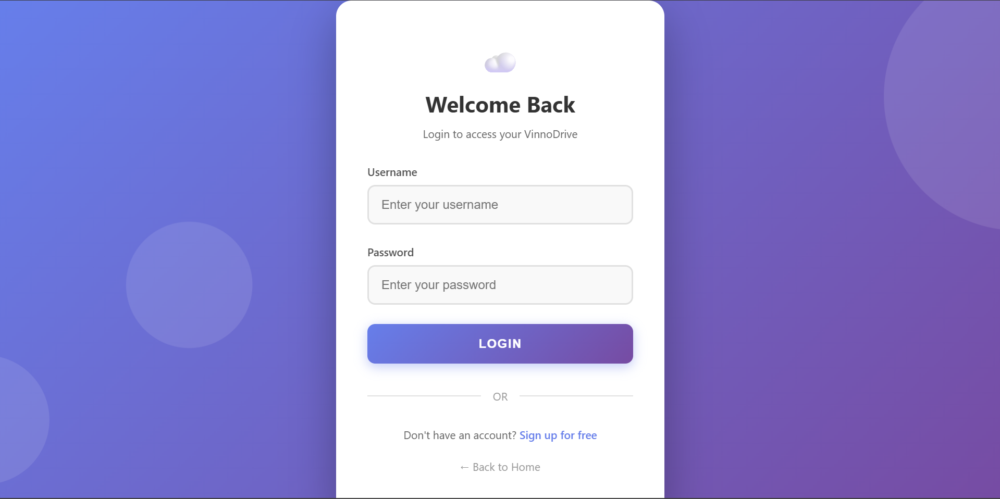
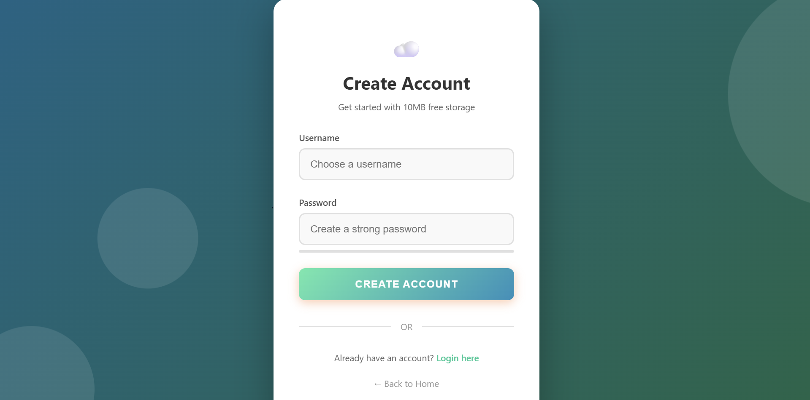
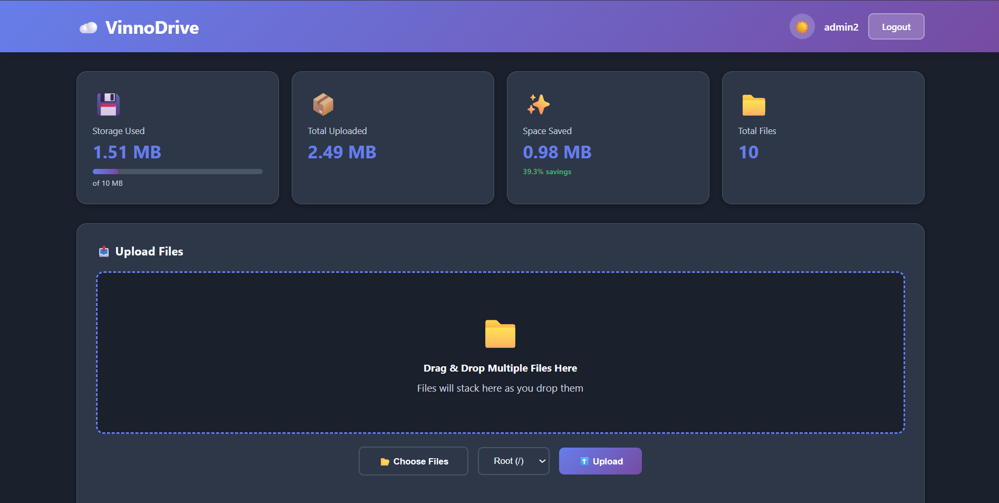
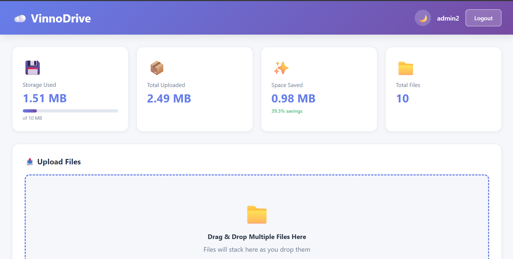

# ☁️ VinnoDrive

VinnoDrive is a **cloud-based file storage and sharing web application** built to manage files efficiently with features like **duplicate file detection**, **folder organization**, **file sharing**, and a **modern interactive dashboard**.

It is designed as a **student-friendly cloud drive** that demonstrates real-world backend + frontend integration using Python and modern web technologies.

---

## 🚀 Features

### 📤 File Upload & Management
- Upload **multiple files** at once (drag & drop supported)
- Upload files into **custom folders**
- Storage **quota tracking** with visual progress bar
- View file size, upload date, and type

### 🧠 Smart Deduplication
- Detects **duplicate files** automatically
- Stores only one physical copy to **save storage space**
- Shows **space saved percentage**
- View all locations where a duplicate file exists

### 📁 Folder System
- Create nested folders (e.g. `documents/work`, `photos/travel`)
- Organize files by folders
- Select all files inside a folder

### 👁️ File Preview
- Preview files directly inside the app:
  - 🖼️ Images
  - 🎥 Videos
  - 🎵 Audio
  - 📄 PDFs (download-based)

### 🔍 Search, Filter & Sort
- Search files by name
- Filter by file type:
  - Images
  - Documents
  - Videos
  - Audio
- Sort by:
  - Name
  - Date
  - Size

### 👥 File Sharing
- Share files with **other registered users**
- See:
  - Files shared *with you*
  - Files shared *by you*
- Toggle **public access** with shareable links
- Track **download count** for public files

### 🗑️ Bulk Actions
- Select multiple files
- Bulk delete files with confirmation

### 🌗 UI & Experience
- Light / Dark mode toggle (saved in browser)
- Responsive design (desktop + mobile)
- Clean, modern dashboard UI

---

## 🛠️ Tech Stack

### Backend
- **Python**
- **FastAPI** (API & server-side logic)
- **SQLite** (database)
- **Jinja2** (templating)

### Frontend
- **HTML5**
- **CSS3** (custom UI, animations, dark mode)
- **JavaScript (Vanilla)**

---

## ⚙️ Installation & Setup

### 1️⃣ Clone the repository
```bash
git clone https://github.com/your-username/vinnodrive.git
cd vinnodrive
```

### 2️⃣ Create virtual environment
```bash
python -m venv venv
venv\Scripts\activate   # Windows
source venv/bin/activate # Linux/Mac
```

### 3️⃣ Install dependencies
```bash
pip install -r requirements.txt
```

### 4️⃣ Run the application
```bash
uvicorn main:app --reload
```

### 5️⃣ Open in browser
```
http://127.0.0.1:8000
```

---

## 📸 Screenshots

### Landing Page


### Login Page


### Signup Page


### Dashboard


### Light Mode



## 🎯 Project Purpose

This project was built to:
- Understand **backend–frontend integration**
- Learn **file handling, storage optimization, and APIs**
- Practice building a **real-world full-stack application**
- Create a **resume-ready project** for internships and placements

---

## 👨‍💻 Author

**Dhyanesh S**  
Student Developer | Full‑Stack Learner

---


